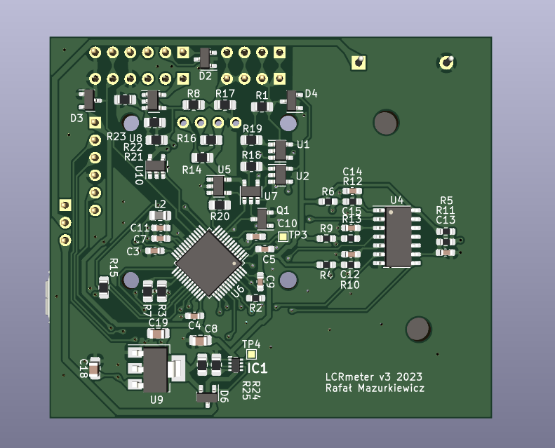
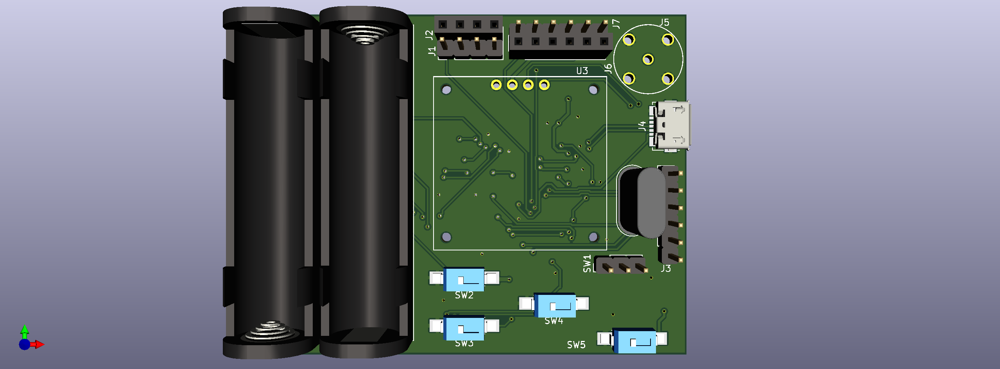

# Note - Work in progress

# About

This is supposed to be a cheap LCR meter but due to wrong hardware currently is not very useful. DAC has slow I2C interface; 
therefore measuring inductance of few microhenrys is impossible.

Sinewave should have up to few kiloherz, but with current hardware only 80-500 Hz is achievable.

