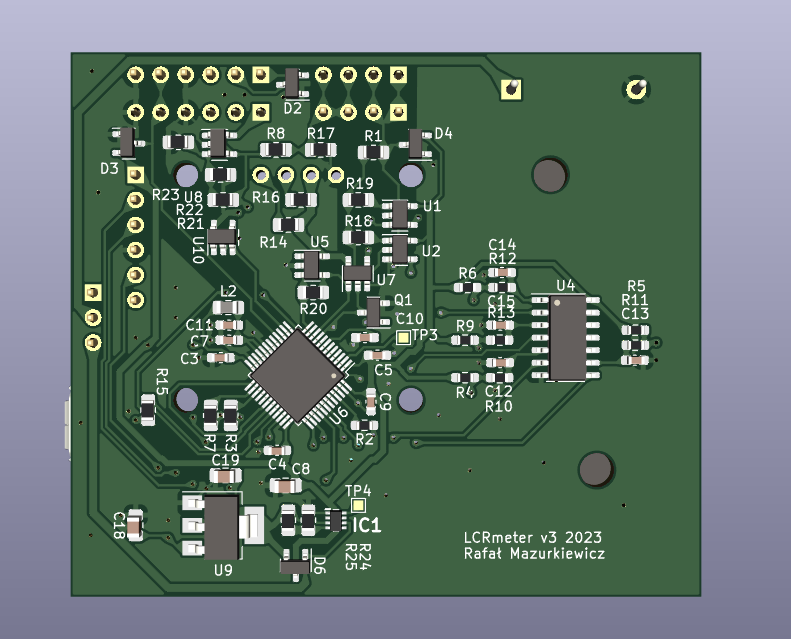
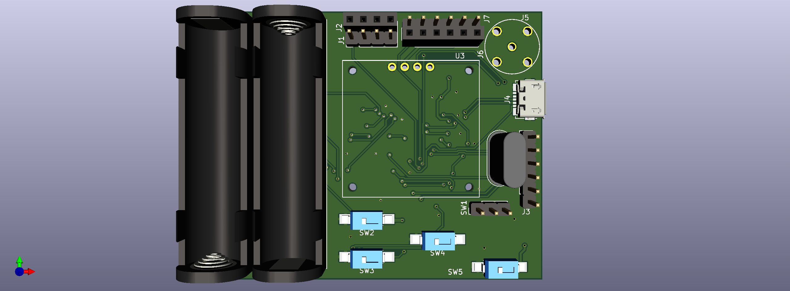

# Note - Work in progress

# About

This is supposed to be a cheap LCR meter but due to wrong hardware currently is not very useful. DAC has slow I2C interface; 
therefore measuring inductance of few microhenrys is impossible.

Sinewave should have up to few kiloherz, but with current hardware only 80-500 Hz is achievable.

# Limitations

Acievable frequency of sinewave for LCR measurments pins is 141,67 kHz, when 2 ADCs are enabled (If ADC is disabled it can go faster).
Up to 2.2V LCR is working corectlly, otherwise op-amps have problems with driving sinewave.

